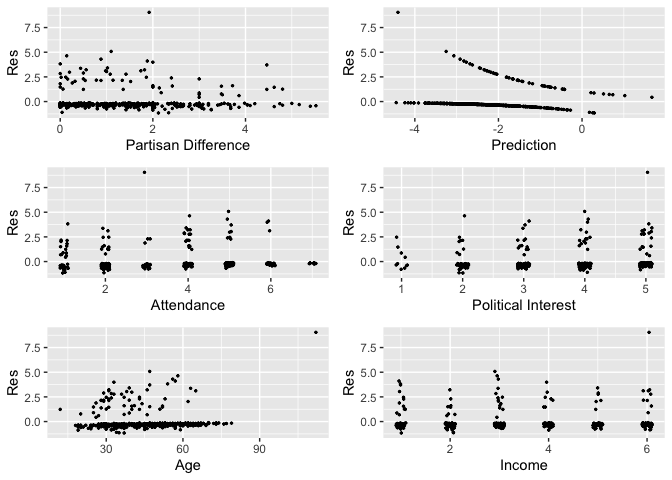
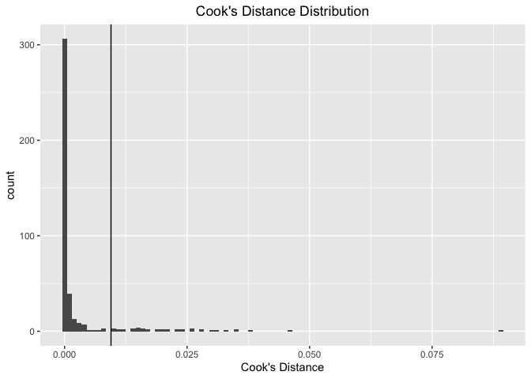
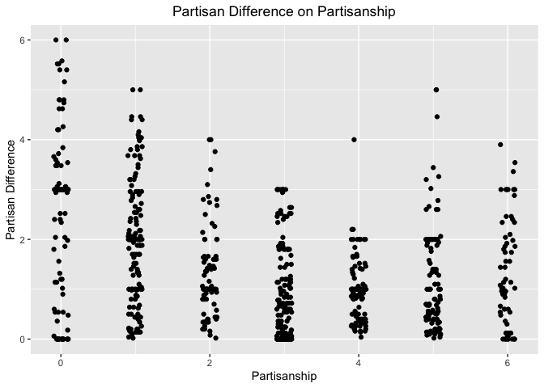

Replication and Extension of ‘Reconsidering the Role of Politics in
Leaving Religion: The Importance of Affiliation’
================
Ian Myers

Djupe, P. A., Neiheisel, J. R., & Sokhey, A. E. (2017). Reconsidering
the Role of Politics in Leaving Religion: The Importance of Affiliation.
American Journal of Political Science, 62(1), 161-175.
<doi:10.1111/ajps.12308>

**Djupe et. al.’s Research Question**

The question Djupe et. al.’s are interested in answering is a question
which falls in the territory of the broader question, How do political
beliefs and behaviors and religious beiefs and behaviors affect one
another? Djupe et. al. note that although religious beliefs and
behaviors has been studied extensively as determinants of political
beiefs and behavior, religious beliefs and behaviors have received less
treatment as effects of political beliefs and behaviors. And while they
note a recent increase in the study of the effects of politics on
religion, they remark in turn that that study has been restricted
primarily to the effects of politics on religious .

But such a focus, they continue, ignores the related but distinct
phenomenon of with a particular place of worship. Now, one might ask why
this matters. After all, although the event of disaffiliating from a
place of worship is admittedly not the same as the event of
disidentification from the religion practiced at that place of worship,
these two events surely occur, for the most part, in quick succession
and as part of one larger event, that of the loss of faith or of faith
that conforms to the requirements of a particular religion. But,
granting all this, there remains the following consideration. Even if
disaffiliation and disidentification for the most part follow upon one
another, is it not possible that the two events are the result of causal
sequences which are, at least to some degree, separable? And if this
partial separability of the causal sequences is borne out by research,
then do we not need to understand disaffiliation, in addition to
disidentification, in order to understand the exact ways in which
political beliefs and behaviors affect religious beliefs and behaviors?

Djupe et. al. suspect that these causal processes are in fact separable.
Much of the existing literature at the time of this article’s
publication, Djupe et. al. claim, speaks to the effects of the rise of
the Christian Right on liberal Americans’ religious identification. As
the Christian Right gained national prominence, liberal Americans became
more likely to affirm no religious preference or to identify themselves
as “religious nones.” The causal process most often posited to explain
this phenomenon is that of national publicity of the Christian Right
leading some Christian liberals to associate their religious identity
with a political identity they are opposed to and, in light of this
conflict, taking the side of their political beliefs and relinquishing
their religious beliefs. This causal process, of course, is one that
connects political beliefs to the choice to disidentify by means of
agents’ awarenesses of broader social and political phenomena. But in
the case of disaffiliation, Djupe et. al. suggest, the connection
between political beliefs and the choice to disaffiliate from a place of
worship would likely involve the agents’ awareness of social and
political phenomena within their place of worship. More concretely, what
Djupe et. al. suggest is that the decision to disaffiliate is likely
determined in part by awareness of political and other differences
between oneself and one’s congregation.

This hypothesis can be seen to be sensible in light of the following two
considerations. For the first consideration, we return to the simple
theoretical explanation given above of the rise of liberal religious
nones after the rise of the Christian Right. We can imagine two liberal
Christians who are equal in their opposition to the Christian Right and
in all other respects except in that the first goes to an Evangelical
church and the second to a more liberal mainline Protestant church.
Although both will, in light of their awareness of the national
phenomenon of the Christian right, associate a set of political
principles they oppose with their religion (although the CR is
associated more with Evangelicals than mainline Protestants, both are
associated by way of being Christian groups), the mainline Protestant
liberal will be less inclined to associate the principles of the CR with
their particular faith if, as is likely, principles and candidates of
the CR are less often endorsed or not at all endorsed in their
congregation. Hence the local level of support for the CR should play
some role in determining the application of the CR -\> disidentification
process mentioned above. For the second consideration, we look to the
case of two Christian Americans who, on account of, say, the “summer
melt,” for a period of time substantially decrease their religious
attendance and, afterwards, begin to plan on returning to their normal
attendance habits. If, however, both are opposed to the CR, then if one
of these Christians is a part of a congregation that supports CR
principles and candidates, then they will likely be more inclined to
consider switching to a church which does not so strongly support the
CR. If, after all, the choice to stay or remain in a religious
organization can be modelled as the result of some species of
cost-benefit analysis, then the presence of a distasteful set of
political beliefs in one’s congregation should increase the perceived
cost of remaining in that congregation even if it does not lead one to
consider leaving one’s faith.

Of course, opposition to the CR is not the only political consideration
that might lead one to consider leaving one’s congregation. Any number
of more restricted political differences could play a similar role.
Hence this, broadly speaking, is the question Djupe et. al. set out to
answer: Do political beliefs affect an individual’s decision to stay or
leave their congregation of evaluations of their political fit in that
congregation, or does this evaluation of political fit play a role in
that decision?

**Data**

Djupe et. al. perform regression analyses on three different sets of
data in this article. All three are two-stage panel datasets consisting
of surveys which inquire about political beliefs, religious beliefs,
disaffiliation, and other controls. I will only replicate Djupe et.
al.’s results taken from the data that I will be using in my extension.
I will provide my justification for selecting this dataset at the
beginning of the section of this paper. This data is a panel dataset
gathered in 2012. The first wave consists of responses to a survey from
mid-OCtober 2012. The second wave consists of responses to a follow up
survey sent out in late November of the same year. of the 1,753
individuals who responded to the first survey, 1,097 responded to the
second survey.

The surveys asked about religious identity, place of worship attendance,
perceived differences between the respondent and the congregation at the
place of worship, and feelings toward Christian fundamentalists. The
second survey also asked whether the respondent had disaffiliated from
the place of worship they attended when the first survey was sent out.

Included below is the code I have used to prepare the data for
regression in accordance with Djupe et. al.’s specifications, given in
their codebook available at the Harvard Dataverse.

**Replication of Results**

My replication of Djupe et. al.’s results was succesful. I first
replicated the part of a table (TABLE 1) which displayed the percentage
of respondents to the 2012 surveys who indicated that they perceived
various differences between themselves and their congregation. I then
replicated the two regression functions which Djupe et. al. produced,
one of which relates the likelihood of church attendance at different
frequencies to variables measured in the first survey, and the other of
which relates the likelihood of disaffiliation to variables measured in
the first survey, one of which is an index of perceived partisan
difference with the congregation. The results are displayed below.

***Percent Differences with their Congregation Reported by
Respondents***

| Differences                   |  Percent |
|:------------------------------|---------:|
| Overall Political Opinions    | 35.76052 |
| Level of Interest in Politics | 37.84219 |
| Age                           | 54.11955 |
| Income and Social Class       | 45.81994 |
| Education Level               | 41.63987 |
| Race/Ethnicity                | 28.61789 |
| Religious Beliefs             | 22.49191 |

The Prevalence of Reported Differences from Other Church Members

***Predicting Worship Attendance and Disaffiliation***

<table style="text-align:center">
<caption>
<strong>Worship Attendance and Disaffiliation</strong>
</caption>
<tr>
<td colspan="3" style="border-bottom: 1px solid black">
</td>
</tr>
<tr>
<td style="text-align:left">
</td>
<td>
<strong>Attendance, Wave 2</strong>
</td>
<td>
<strong>Disaffiliation</strong>
</td>
</tr>
<tr>
<td style="text-align:left">
</td>
<td>
<strong>Model 1</strong>
</td>
<td>
<strong>Model 2</strong>
</td>
</tr>
<tr>
<td colspan="3" style="border-bottom: 1px solid black">
</td>
</tr>
<tr>
<td style="text-align:left">
Partisan Difference with Congregation
</td>
<td>
</td>
<td>
.685\*\*
</td>
</tr>
<tr>
<td style="text-align:left">
</td>
<td>
</td>
<td>
p = .026
</td>
</tr>
<tr>
<td style="text-align:left">
Attendance, Wave 1
</td>
<td>
1.603\*\*\*
</td>
<td>
-.226
</td>
</tr>
<tr>
<td style="text-align:left">
</td>
<td>
p = 0.00000
</td>
<td>
p = .181
</td>
</tr>
<tr>
<td style="text-align:left">
Differences Index
</td>
<td>
-2.925
</td>
<td>
</td>
</tr>
<tr>
<td style="text-align:left">
</td>
<td>
p = .160
</td>
<td>
</td>
</tr>
<tr>
<td style="text-align:left">
Political Interest
</td>
<td>
.045
</td>
<td>
-.145
</td>
</tr>
<tr>
<td style="text-align:left">
</td>
<td>
p = .641
</td>
<td>
p = .305
</td>
</tr>
<tr>
<td style="text-align:left">
Church Discussant
</td>
<td>
-.146
</td>
<td>
.054
</td>
</tr>
<tr>
<td style="text-align:left">
</td>
<td>
p = .527
</td>
<td>
p = .887
</td>
</tr>
<tr>
<td style="text-align:left">
Ideology
</td>
<td>
-.190
</td>
<td>
.007
</td>
</tr>
<tr>
<td style="text-align:left">
</td>
<td>
p = .320
</td>
<td>
p = .981
</td>
</tr>
<tr>
<td style="text-align:left">
Feelings toward Christian Fundamentalists
</td>
<td>
-.516
</td>
<td>
.680
</td>
</tr>
<tr>
<td style="text-align:left">
</td>
<td>
p = .566
</td>
<td>
p = .640
</td>
</tr>
<tr>
<td style="text-align:left">
Female
</td>
<td>
-.068
</td>
<td>
-.085
</td>
</tr>
<tr>
<td style="text-align:left">
</td>
<td>
p = .753
</td>
<td>
p = .792
</td>
</tr>
<tr>
<td style="text-align:left">
Income
</td>
<td>
.072
</td>
<td>
-.125
</td>
</tr>
<tr>
<td style="text-align:left">
</td>
<td>
p = .295
</td>
<td>
p = .209
</td>
</tr>
<tr>
<td style="text-align:left">
Education
</td>
<td>
-.211\*
</td>
<td>
-.059
</td>
</tr>
<tr>
<td style="text-align:left">
</td>
<td>
p = .069
</td>
<td>
p = .733
</td>
</tr>
<tr>
<td style="text-align:left">
Age
</td>
<td>
-.012
</td>
<td>
-.035\*\*\*
</td>
</tr>
<tr>
<td style="text-align:left">
</td>
<td>
p = .120
</td>
<td>
p = .005
</td>
</tr>
<tr>
<td style="text-align:left">
Mainline Protestant
</td>
<td>
-.389
</td>
<td>
.158
</td>
</tr>
<tr>
<td style="text-align:left">
</td>
<td>
p = .205
</td>
<td>
p = .757
</td>
</tr>
<tr>
<td style="text-align:left">
Catholic
</td>
<td>
-.554\*
</td>
<td>
.250
</td>
</tr>
<tr>
<td style="text-align:left">
</td>
<td>
p = .067
</td>
<td>
p = .609
</td>
</tr>
<tr>
<td style="text-align:left">
Black Protestant
</td>
<td>
-.249
</td>
<td>
.341
</td>
</tr>
<tr>
<td style="text-align:left">
</td>
<td>
p = .543
</td>
<td>
p = .598
</td>
</tr>
<tr>
<td style="text-align:left">
Other Religion
</td>
<td>
.425
</td>
<td>
.855
</td>
</tr>
<tr>
<td style="text-align:left">
</td>
<td>
p = .282
</td>
<td>
p = .119
</td>
</tr>
<tr>
<td style="text-align:left">
Attendance X Differences
</td>
<td>
.524
</td>
<td>
</td>
</tr>
<tr>
<td style="text-align:left">
</td>
<td>
p = .265
</td>
<td>
</td>
</tr>
<tr>
<td style="text-align:left">
Attendance X Partisan Difference
</td>
<td>
</td>
<td>
-.132
</td>
</tr>
<tr>
<td style="text-align:left">
</td>
<td>
</td>
<td>
p = .109
</td>
</tr>
<tr>
<td style="text-align:left">
Ideology X Fundamentalists
</td>
<td>
.206
</td>
<td>
.134
</td>
</tr>
<tr>
<td style="text-align:left">
</td>
<td>
p = .490
</td>
<td>
p = .765
</td>
</tr>
<tr>
<td style="text-align:left">
Constant
</td>
<td>
</td>
<td>
.402
</td>
</tr>
<tr>
<td style="text-align:left">
</td>
<td>
</td>
<td>
p = .788
</td>
</tr>
<tr>
<td style="text-align:left">
N
</td>
<td>
414
</td>
<td>
441
</td>
</tr>
<tr>
<td style="text-align:left">
Log Likelihood
</td>
<td>
</td>
<td>
-147.812
</td>
</tr>
<tr>
<td style="text-align:left">
AIC
</td>
<td>
</td>
<td>
329.625
</td>
</tr>
<tr>
<td colspan="3" style="border-bottom: 1px solid black">
</td>
</tr>
<tr>
<td colspan="3" style="text-align:left">
***p \< .01; **p \< .05; *p \< .1
</td>
</tr>
</table>

As can be seen, Djupe et. al. found that attendance in the first wave
was the only significant predictor of attendance during the second wave
and that age and partisan difference were the only statistically
significant predictors of disaffiliation by the time of the second wave.
This result regarding the connection between perceived political
difference with one’s congregation and disaffiliation lends support to
Djupe et. al.’s hypothesis that evaluation of political fit in one’s
congregation affect disaffiliation decisions.

Since the model used by Djupe et. al. for the regression on
disffiliation is the model I will be modifying for my extension, I will
present it here:

**Evaluation**

I present below the results of various diagnostic tests for the
Disaffilation regression along with a new regression for the same model
run on data that has been pared of observations which have DFBETAS above
the cutoff level. I do not include diagnostics for the Attendance
regression since I will not be using it in my extension and since it is
an ordered logit model.

***Disaffiliation Residuals Plots***

<!-- -->

I have included above a few examples of plots of the pearson residuals
of the regression on various independent variables. One can see that
there appear with several of these variables to be heteroskedasticity
problems. For example, the pearson residuals are positively correlated
with age.

***Influence Points***

*Disaffiliation DFBETAS*

There are 19 observations for which the DFBETAS are over the usual
cutoff. If we remove these observations, we get these results:

<table style="text-align:center">
<caption>
<strong>Disaffiliation with Influence Points Removed</strong>
</caption>
<tr>
<td colspan="3" style="border-bottom: 1px solid black">
</td>
</tr>
<tr>
<td style="text-align:left">
</td>
<td colspan="2">
<strong>Disaffiliation</strong>
</td>
</tr>
<tr>
<td style="text-align:left">
</td>
<td>
<strong>Original</strong>
</td>
<td>
<strong>Trimmed of Influence Points</strong>
</td>
</tr>
<tr>
<td style="text-align:left">
</td>
<td>
<strong>Model 1</strong>
</td>
<td>
<strong>Model 2</strong>
</td>
</tr>
<tr>
<td colspan="3" style="border-bottom: 1px solid black">
</td>
</tr>
<tr>
<td style="text-align:left">
Partisan Difference with Congregation
</td>
<td>
.685
</td>
<td>
1.223
</td>
</tr>
<tr>
<td style="text-align:left">
</td>
<td>
p = .026\*\*
</td>
<td>
p = .002\*\*\*
</td>
</tr>
<tr>
<td style="text-align:left">
Attendance, Wave 1
</td>
<td>
-.226
</td>
<td>
.028
</td>
</tr>
<tr>
<td style="text-align:left">
</td>
<td>
p = .181
</td>
<td>
p = .888
</td>
</tr>
<tr>
<td style="text-align:left">
Political Interest
</td>
<td>
-.145
</td>
<td>
.107
</td>
</tr>
<tr>
<td style="text-align:left">
</td>
<td>
p = .305
</td>
<td>
p = .532
</td>
</tr>
<tr>
<td style="text-align:left">
Church Discussant
</td>
<td>
.054
</td>
<td>
-.101
</td>
</tr>
<tr>
<td style="text-align:left">
</td>
<td>
p = .887
</td>
<td>
p = .810
</td>
</tr>
<tr>
<td style="text-align:left">
Ideology
</td>
<td>
.007
</td>
<td>
.674
</td>
</tr>
<tr>
<td style="text-align:left">
</td>
<td>
p = .981
</td>
<td>
p = .096\*
</td>
</tr>
<tr>
<td style="text-align:left">
Feelings toward Christian Fundamentalists
</td>
<td>
.680
</td>
<td>
4.215
</td>
</tr>
<tr>
<td style="text-align:left">
</td>
<td>
p = .640
</td>
<td>
p = .030\*\*
</td>
</tr>
<tr>
<td style="text-align:left">
Female
</td>
<td>
-.085
</td>
<td>
.286
</td>
</tr>
<tr>
<td style="text-align:left">
</td>
<td>
p = .792
</td>
<td>
p = .440
</td>
</tr>
<tr>
<td style="text-align:left">
Income
</td>
<td>
-.125
</td>
<td>
-.067
</td>
</tr>
<tr>
<td style="text-align:left">
</td>
<td>
p = .209
</td>
<td>
p = .559
</td>
</tr>
<tr>
<td style="text-align:left">
Education
</td>
<td>
-.059
</td>
<td>
.161
</td>
</tr>
<tr>
<td style="text-align:left">
</td>
<td>
p = .733
</td>
<td>
p = .438
</td>
</tr>
<tr>
<td style="text-align:left">
Age
</td>
<td>
-.035
</td>
<td>
-.034
</td>
</tr>
<tr>
<td style="text-align:left">
</td>
<td>
p = .005\*\*\*
</td>
<td>
p = .022\*\*
</td>
</tr>
<tr>
<td style="text-align:left">
Mainline Protestant
</td>
<td>
.158
</td>
<td>
.822
</td>
</tr>
<tr>
<td style="text-align:left">
</td>
<td>
p = .757
</td>
<td>
p = .182
</td>
</tr>
<tr>
<td style="text-align:left">
Catholic
</td>
<td>
.250
</td>
<td>
1.006
</td>
</tr>
<tr>
<td style="text-align:left">
</td>
<td>
p = .609
</td>
<td>
p = .094\*
</td>
</tr>
<tr>
<td style="text-align:left">
Black Protestant
</td>
<td>
.341
</td>
<td>
.983
</td>
</tr>
<tr>
<td style="text-align:left">
</td>
<td>
p = .598
</td>
<td>
p = .172
</td>
</tr>
<tr>
<td style="text-align:left">
Other Religion
</td>
<td>
.855
</td>
<td>
1.839
</td>
</tr>
<tr>
<td style="text-align:left">
</td>
<td>
p = .119
</td>
<td>
p = .006\*\*\*
</td>
</tr>
<tr>
<td style="text-align:left">
Attendance X Partisan Difference
</td>
<td>
-.132
</td>
<td>
-.244
</td>
</tr>
<tr>
<td style="text-align:left">
</td>
<td>
p = .109
</td>
<td>
p = .012\*\*
</td>
</tr>
<tr>
<td style="text-align:left">
Ideology X Fundamentalists
</td>
<td>
.134
</td>
<td>
-.577
</td>
</tr>
<tr>
<td style="text-align:left">
</td>
<td>
p = .765
</td>
<td>
p = .302
</td>
</tr>
<tr>
<td style="text-align:left">
Constant
</td>
<td>
.402
</td>
<td>
-6.555
</td>
</tr>
<tr>
<td style="text-align:left">
</td>
<td>
p = .788
</td>
<td>
p = .003\*\*\*
</td>
</tr>
<tr>
<td style="text-align:left">
N
</td>
<td>
441
</td>
<td>
422
</td>
</tr>
<tr>
<td style="text-align:left">
Log Likelihood
</td>
<td>
-147.812
</td>
<td>
-113.988
</td>
</tr>
<tr>
<td style="text-align:left">
AIC
</td>
<td>
329.625
</td>
<td>
261.975
</td>
</tr>
<tr>
<td colspan="3" style="border-bottom: 1px solid black">
</td>
</tr>
<tr>
<td colspan="3" style="text-align:left">
***p \< .01; **p \< .05; *p \< .1
</td>
</tr>
</table>

The removal of these observations (unsurprisingly) decreases the AIC of
the regression. More interesting, however, is that with their removal,
the coefficients for feelings towards Christian fundamentalists and
identifying as another religion become significant. Significant also is
the fact that the attendance and partisan difference interaction term
becomes significant.

But before we can recommend that these observations with high DFBETAS be
left out of the regression data, we need to examine them to see whether
there is any indication that they are the result of a different data
generation process. Having done such an examination, I suspect that
these observations can be left out of the regression data. This is
because these observations, about 70% of which disaffiliated, also had
lower church attendance in wave 1 than the average of the observations
used in this regression. This might suggest that these outliers are
cases of disaffiliation not so much as a result of political differences
as out of what we might call laziness or business, depending on the
case. Of course, including these observations would be necessary if one
wanted to give a complete account of the causes of disaffiliation, but
if one is interested only in the political determinants of
disaffiliation, then excluding them may be permissible.

*Cook’s Distance*

I will also check to see whether any observations have a Cook’s D value
above the conventional cutoff.

<!-- -->

As can be seen in the plot above, there are a good number of
observations with high Cook’s distances. These would merit
investigation. In general, this data has quite a few influence points. I
wonder whether the reason is that since only 14% of the respondents
disaffiliated from their churches, all of the observations with a
disaffiliation value of 1 have become outliers which, if they also have
even somewhat peculiar independent variable values, could become
influence points. This is corroborated, though perhaps only in a small
measure, by the fact that of the 42 observations for which the Cook’s
distance is greater than the cutoff, 39 are cases in which the
respondent disaffiliated.

*Studentized Residuals and Hat Values*

None of the observations has both a hat value and studentized residual
greater than their respective cutoffs. As was predicted above, however,
the observations for which disaffiliation = 1 have greater studentized
residuals than the rest of the observations.

<!-- -->

***Multicollinearity***

Below are presented the GVIF values for the independent variables.
Several of the independent variables have values uncomfortably close to
10. However, since the effects of none of the independent variables of
interest (partisan difference) were not obscured, this is likely not an
issue.

    ## there are higher-order terms (interactions) in this model
    ## consider setting type = 'predictor'; see ?vif

    ##                      partisanDifference                    as.numeric(attendw1) 
    ##                                6.381795                                3.124366 
    ##                       politicalInterest                             net_churchc 
    ##                                1.092806                                1.239689 
    ##                                ideology                 christianFundamentalism 
    ##                                4.476895                                8.828415 
    ##                                  female                                  income 
    ##                                1.112318                                1.192817 
    ##                               education                                     age 
    ##                                1.233470                                1.094413 
    ##                                mainline                                catholic 
    ##                                2.017651                                2.018326 
    ##                         blackProtestant                                   other 
    ##                                1.304603                                2.149402 
    ## partisanDifference:as.numeric(attendw1)        ideology:christianFundamentalism 
    ##                                7.456652                                9.169013

**Extension**

My extension consists in a modification of the model used by Djupe et.
al. to estimate the effects of partisan difference and the controls on
the likelihood of disaffiliation. Before I present that modification, I
will explain the question I aim to answer and the theoretical background
of that question. In the paper, Djupe et. al. do not only predict on the
basis of their theory that perceived partisan difference with one’s
congregation will make one more likely to disaffiliate from one’s
congregation. They also (paradoxically) predict that evangical who
oppose the Christian Right will be most likely to disaffiliate from
their churches, at least during the election season. Their explanation
of this strange prediction is as follows. Christians of every
denomination who attend a church will be likely to have sorted
themselves politically to some degree. That is, Republican Catholics,
mainline Protestants, and Evangelicals are all more likely to attend
churches with a greater number of Republican attendees, and likewise
with Christian Democrats. Since the Christian Right is the most
prominent American political coalition associated with Christianity, and
since politicians and political principles associated with the Christian
Right will be more often endorsed in “Republican” churches, Christian
Republicans who oppose the Christian Right, in distinction to Christian
Democrats who oppose the Christian Right, will be more likely to
encounter a politics they do not like in their churches, especially
during election cycles. For this reason, Christian Republicans, and, in
particular, Evangelical Republicans, in the aggregate will be more
likely to disaffiliate from their churches during election cycles.

The Djupe et. al. find support for this prediction in their analysis of
the third dataset they use, the 2012 Portraits of American Life
survery–of those surveyed, Evangelicals who are strong Republicans and
oppose the Christian Right were more likely to disaffiliate from their
churches than any other group. However, as they admit, this survey does
not include measures of respondents’ perceived partisan difference with
their church. This means that Djupe et. al. are not able to confirm that
the reason for the greater attrition rate on the part of Evangelical
Republicans opposed to the CR was the political difference they
perceived with their congregation.

Using the first dataset, however, we can try to confirm this
interpretation of the results of the analysis of the Portraits data and
replicate those results in addition. We can do this because in addition
to having variables for disaffiliation, and partisanship, we have a
variable which measures “overall political differences” between a
respondent and their congregation (the partisan difference variable does
not suffice since this might not record the difference between a
Republican CR oppenent and a congregation of Republican CR supporters).
Hence we can construct the following model:

The important difference between this model and the model used in the
paper for disaffiliation is that this model contains three interaction
terms between the denominations and Political Differences. Since
Political Differences is coded such that 0 is no differences and 4 is
strong differences, we expect, if Djupe et. al.’s theory is correct,
that the coefficients for the denomination X partisanship interaction
terms will be less than zero (since the Evangelicals, for whom we expect
the effect to be greatest, are left out). Below are the results of this
regression on the 2012 panel data.

<table style="text-align:center">
<caption>
<strong>Modified Disaffiliation Model</strong>
</caption>
<tr>
<td colspan="2" style="border-bottom: 1px solid black">
</td>
</tr>
<tr>
<td style="text-align:left">
</td>
<td>
<strong>Disaffiliation</strong>
</td>
</tr>
<tr>
<td colspan="2" style="border-bottom: 1px solid black">
</td>
</tr>
<tr>
<td style="text-align:left">
Partisan Difference with Congregation
</td>
<td>
.091
</td>
</tr>
<tr>
<td style="text-align:left">
</td>
<td>
p = .552
</td>
</tr>
<tr>
<td style="text-align:left">
Political Differences
</td>
<td>
-.402
</td>
</tr>
<tr>
<td style="text-align:left">
</td>
<td>
p = .344
</td>
</tr>
<tr>
<td style="text-align:left">
Catholic
</td>
<td>
1.101
</td>
</tr>
<tr>
<td style="text-align:left">
</td>
<td>
p = .498
</td>
</tr>
<tr>
<td style="text-align:left">
Mainline Protestant
</td>
<td>
.389
</td>
</tr>
<tr>
<td style="text-align:left">
</td>
<td>
p = .822
</td>
</tr>
<tr>
<td style="text-align:left">
Black Protestant
</td>
<td>
-2.030
</td>
</tr>
<tr>
<td style="text-align:left">
</td>
<td>
p = .515
</td>
</tr>
<tr>
<td style="text-align:left">
Age
</td>
<td>
-.048
</td>
</tr>
<tr>
<td style="text-align:left">
</td>
<td>
p = .002\*\*\*
</td>
</tr>
<tr>
<td style="text-align:left">
Political Differences X Catholic
</td>
<td>
-.416
</td>
</tr>
<tr>
<td style="text-align:left">
</td>
<td>
p = .505
</td>
</tr>
<tr>
<td style="text-align:left">
Political Differences X Mainline
</td>
<td>
-.107
</td>
</tr>
<tr>
<td style="text-align:left">
</td>
<td>
p = .870
</td>
</tr>
<tr>
<td style="text-align:left">
Political Differences X Black Protestant
</td>
<td>
.939
</td>
</tr>
<tr>
<td style="text-align:left">
</td>
<td>
p = .399
</td>
</tr>
<tr>
<td style="text-align:left">
Constant
</td>
<td>
.503
</td>
</tr>
<tr>
<td style="text-align:left">
</td>
<td>
p = .711
</td>
</tr>
<tr>
<td style="text-align:left">
N
</td>
<td>
376
</td>
</tr>
<tr>
<td style="text-align:left">
Log Likelihood
</td>
<td>
-104.413
</td>
</tr>
<tr>
<td style="text-align:left">
AIC
</td>
<td>
228.825
</td>
</tr>
<tr>
<td colspan="2" style="border-bottom: 1px solid black">
</td>
</tr>
<tr>
<td colspan="2" style="text-align:left">
***p \< .01; **p \< .05; *p \< .1
</td>
</tr>
</table>

The results, unfortunately, are not significant. Although the signs of
the coefficients are as we predicted for the interaction terms with
Catholics and Mainline protestants, the sign is not what we expected for
the interaction term with Black Protestants, and significance of all
three coefficients is well below the standard threshold.

**Conclusion**

In retrospect, part, if not all, of the reason for the lack of the
results is the following. I should have checked to see whether the claim
that worshipers politically sort and do so to the same extent
irrespective of partisan leaning is sound. Below is a plot of perceived
partisan difference with one’s congregation on partisanship.
Partisanship is coded such that a strong Democrat is a 0 and a strong
Republican is a 7.

    ## Warning: Removed 221 rows containing missing values (`geom_point()`).

<!-- -->

Although, as we would expect, strong Democrats and strong Republicans
both seem to find themselves in congregations with fellow worshipers who
differ more than those of moderate partisans, it seems that Democrats
more often than Republicans find themselves in congregations with others
who have different partisan positions. Moreover, Partsan Difference is
significantly correlated with Political Difference, as can be seen in
the small correlation table below.

    ##                     partisanship
    ## partisanship                    
    ## politicaldifference     0.25****

The effect of all this is that 1) Political Differences cannot by any
means be understood to capture only difference in support of the
Christian Right since Political Differences also captures Partisan
Difference, which is felt more by Democrats than by Republicans. Hence
the model provided above is not sufficient to test the hypothesis that
Evangelical Republicans are more likely to leave their congregations on
account of tension over support for the Christian Right. What would be
needed to test this hypothesis is data which measures Christian
Denomination, Partisanship, Disaffiliation, and Difference within one’s
congregation on support for the Christian Right.
