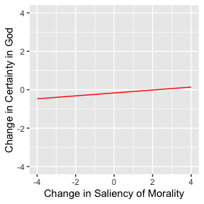
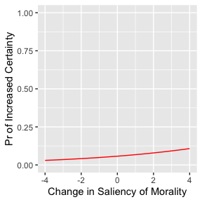
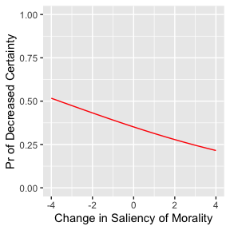

Morality and Religious Belief
================
Ian Myers
3/17/2020

## Question

Of practical questions, some are moral, and some are non-moral. It
should suffice to distinguish the two by remarking that while, in the
case of the non-moral, the standard against which actions are properly
judged is the benefit of an individual, in the case of the moral, the
standard is something other than, higher than, the benefit of an
individual. As manifold as these higher standards may be, they are
united in drawing our eyes away from that concern that might appear to
be deepest in us, the concern for our own well-being. In light of this
distinction, we can understand different individuals to be at different
locations on a continuum of how salient moral standards are to their
evaluations of answers to practical questions. Those who are more
“moral” will understand moral standards to be more important for
evaluating answers to more practical questions, and those who are less
“moral” will understand moral standards to be less important and
relevant in fewer matters. The question I here investigate is whether an
individual’s movement on this continuum from more moral to less moral
predicts a negative change in that individual’s certainty in the
existence of a god.

## Literature

Before stating my hypothesis and the theoretical grounds for it, I will
briefly indicate how the state of the literature on the causal relations
between political identity, religious identity, and relative inclination
to different “moral foundations” suggests both the necessity of raising
this question and guidelines for how to understand it. With some
exceptions, scholars prior to the early 2000’s primarily understood
religious belief and identification as a basic fact, i.e. as a fact
which explains but is not explained by variables in the domain ruled by
political science. According to this understanding, the increasing
alignment of Republican vs. Democrat identification with religious vs
religious none identification is a consequence of individuals sorting
themselves politically in accord with the prior fact of their religious
identification (see, e.g., Campbell et al. 1960; Layman 2001). This
understanding, however, has been questioned and to a large extent
refuted in the past 20 years as scholars have found that the causality
works as well in the other direction, from political identification to
religious identification and belief (Hout and Fischer 2002; Patrikios
2008; Baker and Smith 2009; Putnam and Campbell 2010). But much of the
work clarifying this new causal direction has been limited to clarifying
the effect of political identification on religious identification and
congregational affiliation, leaving open the question of how religious
beliefs themselves are affected (Patrikios 2008; Djupe et al. 2017; see
especially Hout and Fischer 2002, which notes that those who change to
religious nones do not always appear to change their beliefs). And those
that have looked at religious belief as an effect of political
identification (e.g. Campbell et al. 2018) have largely ignored what, it
seems to me, might be the deeper cause.

What is perhaps the most common (see, e.g., Djupe et al. 2017)
theoretical explanation of the power of political identification to
shape religious identification and belief can be put, however crudely,
in the following way: individuals tend to sort themselves politically
and socially in consistent ways; the Republican party has become
popularly associated with religiosity; religious Democrats will
therefore be likely to resort themselves either politically or
religiously; political sorting is more or as fundamental as religious
sorting; religious Democrats will therefore be likely to resort
themselves as religious nones, and some might even take the next step of
modifying or dropping their religious beliefs. Such a theory is no doubt
sensible and, more than that, likely correct, but it leaves open the
question of whether there is an additional, deeper reason (deeper than
the what might be understood as accidental fact of a common association
of religiosity with the Republican party) for the effect political
beliefs have on religious beliefs. My hypothesis is that it is not only
an individual’s political identification or political beliefs, but also
their evaluative framework (morality vs non-morality), which both causes
and is caused by their particular political beliefs, that causes their
religious beliefs.

## Theory

The concept that most needs to be explained here is that of the moral
individual, or of the moral continuum which individuals fall at
different points on, which I will call the continuum of morality. It
will be helpful first to state what this concept does not signify.
Morality as I am using it here does not signify a genetic predisposition
to evaluate answers to practical questions with reference to certain
standards rather than others. Nor does it signify a manner of thinking
which simply explains or causes the particular value judgments that an
individual makes. According to that view, when we are faced with a
practical question, we come to answers by inferring practical
propositions from the axioms that our moral standards constitute. This,
however, is of course not how even the most thoughtful of us make most
of our judgments when faced with practical questions. What happens for
the most part, in the theory I am supposing, is that when faced with
practical questions we have a gut reaction that carries along with it an
answer to that question (an opinion). That gut reaction and the opinion
that comes along with it arises prior to thoughtful reflection on the
question, but it in most cases implies certain more general opinions
about the facts of practical human life. Someone who opines that
abortion should be illegal after the second term, for example, likely
can be led to say that fetuses after the second term are humans, that
humans have a right to life, and that one has an obligation to respect
the rights of others.

Because we have a great number of practical opinions, we are liable to
have opinions implied by those opinions that contradict each other. When
such a contradiction first becomes apparent, and when no psychological
obstacle hinders us from recognizing the full implications of that
contradiction, we discard that one of the contradictory opinions which
grips us less strongly. On the other hand, as the consistency of our
opinions slowly increases, we begin to see more and more what the
broader, more fundamental opinions implied by those opinions are. These
more fundamental practical beliefs or opinions are in some way the
causes of our particular practical opinions, but, again, we are not
aware of them or this causal power of theirs until we investigate what
is implied by our practical opinions.

Now there is a hypothesis common to the ancient political philosophers
that belief in a god or gods is bound up with belief in the importance
of justice, or of the importance of abiding by standards of conduct
which are in tension with and higher than the principle of acting in
one’s own interest. There follows from that hypothesis the testable
hypothesis that the genuine rejection of the belief in the importance of
justice and the replacement of that belief with the belief that one’s
enlightened interest is the right principle for action leads to the
weakening and eventual disappearance of the belief in a god or gods. The
theoretical basis for that testable hypothesis is something as follows.
There is a tension in the common understanding of justice. On the one
hand, we say that justice is difficult and often involves the sacrifice
of our good, and our anger at those who get away with injustice indicate
that we believe that justice is in an important way bad and injustice
good. On the other hand, parents, who above all want what is best for
their children, exhort their children to be just. Moreover, only the
wicked would choose to be unjust, and surely no one would say that
wickedness is good. According to the common understanding of justice
then, justice is both good and bad. This tension in the common
understanding is caused by our understanding just actions, and
especially of the most spectacular just actions, to be noble sacrifices
that are somehow good precisely on account of being noble sacrifices. It
is of course difficult to explain how something can be good precisely on
account of its being a sacrifice (i.e. on account of its being bad for
us). What then is the explanation given by the ancient political
philosophers for this perplexing phenomenon, which consists, on the one
hand, in the nearly universal human agreement in the compatibility of
one’s good and a sacrifice of one’s good and, on the other hand, in the
just as universal human wavering on the question of the goodness for
justice? The clear equation of the sacrifice of our own good and our own
highest good is untenable for human minds on account of its being a
direct contradiction, but one of the important ways in which such a
contradictory equation could be made psychologically maintainable is by
the addition of a secret hope that, since we understand sacrifices to be
grounds for desert, our justice will make us deserving of great rewards.
That hope must remain secret, and the contradictory equation must remain
in some form maintained because were they not, our choices to act justly
would be transparently motivated by our concern for our own good—were we
to say that justice is not good for its own sake but good because it
will lead to our being rewarded, we would undermine the basis for our
being rewarded, which we understand to be our willingness to sacrifice
our own good without expecting a reward. But just human beings are not
always or even as a rule rewarded for their sacrifices. For this reason,
a just human being is more likely to hope, and hence even come to
believe, that a god that rewards the righteous and punishes the wicked
exists, and a human being less concerned with justice is less likely to
hope for and believe in such a god. In short, according to the ancient
political philosophers, one of the great causes of belief in a god or
gods is our longing for a being or force, not supplied by the natural
order, which will reward justice and punish injustice. And this
proposition can be generalized such that by ‘justice’ is meant all
actions and dispositions to action which look not to the standard of
one’s own good but to another standard understood to be higher. We can
thus express the proposition in its generalized form as follows: the
greater the saliency of moral standards to an individual, the more
likely they are to believe in a god.

More detailed and precise statements of this thought, along with
discussions of its implications, can be found in the chapters “Theages”
and “Euthyphro” of Bruell 1999 and pp. 69-70 and 92-100 of Leibowitz
2010.

## Research Design

The unit of analysis here is the individual, and the data used comes
from the 2012 Portraits of American Life Study (PALS). This data is
two-wave panel data collected by phone in 2006 and 2012 from U.S.
civilians aged 18 or over living in the U.S.

I estimate two models, a linear model and a gologit model. The dependent
variable, change in an individual’s certainty about the existence of
god, is operationalized in two ways (for the two models). In both waves
of the survey, participants were asked to say whether they strongly
agree, somewhat agree, etc. to the statement “I definitely believe in
God.” For my linear model, I count strongly agree as 4 and strongly
disagree as 0 and subtract the second wave number from the first wave
number. This will result in a variable with 9 possible values ranging
from -4 to 4. For my gologit model, I operationalize change in certainty
about the existence of god by reducing the variable to one with three
values: -1 for a decrease from wave 1 to 2 in agreement with the
statement; 0 for no change; and 1 for an increase in agreement with the
statement.

The independent variable, the salience of moral standards in the matter
of political questions, is operationalized as follows. Both waves of the
survey contain two questions in which participants are asked to say
whether a matter is always morally wrong, usually morally wrong,
sometimes morally wrong, never morally wrong, or not a moral issue. The
first of these questions concerns “having an abortion when the fetus is
old enough to survive on its own outside the mothers womb,” and the
second concerns “using genetic engineering, that is changing a persons
DNA or genes, to create a baby that is smarter, stronger, or better
looking.” I assign to the response “always morally wrong” the value 4
and to the response “not a moral issue” the value 0. I then subtract the
individual’s wave 1 responses from their wave 2 responses. There are in
this way two main independent variables with values ranging from -4 to
4, where positive values indicate an increase for the individual in the
salience of moral standards to the question asked.

The great limitation of this operationalization of the independent
variable of interest lies in the questions the participants are asked
about. That the questions are only two in number and both relate to the
narrow matter of human reproduction (abortion and genetic engineering)
means that this variable cannot be understood to signify the salience
for the individual of moral standards to practical and political
questions generally—one can imagine an individual who thinks neither
abortion nor genetic engineering is a moral issue but who has strong
moral convictions about other matters. With that being said however,
since the salience for an individual of moral standards to one set of
questions would seemingly predict with some accuracy the salience for
them of moral standards to practical and political questions in general,
the theory detailed above should still support the modified hypothesis
that individuals whose estimation of reproductive issues as moral issues
decreases will be more likely to decrease in certainty about the
existence of a god.

The linear and gologit model I estimate are as follows. The control
variables used in the linear model are the same as those listed in the
Gologit model results below.

### Linear Model

### Gologit Model

=\frac{exp(X_{i}'\beta_{j} -\mu_{j})}{1+exp(X_{i}'\beta_{j}-\mu_{j})}, j=1,2,...,m-1")

where

is the same as the right side of the linear model without the error
random variable or intercept parameter. Which

parameters are restricted and which unrestricted can be seen in the
Gologit model results below.

## Results (Linear Model)

The estimated parameters for the linear model that are significant are
presented below in table 1. While change in an individual’s take on the
salience of moral standards to the question of abortion did not have a
statistically significant effect on their change in certainty about the
existence of God, change in an individual’s take on the salience of
moral standards to the question of genetic engineering of humans did.
This indicates that changes in at least some moral beliefs might be
causally related to changes in certainty in the existence of God
independently of PID or party affiliation.

The graph below shows the expected change in certainty in the existence
of God given a change in the salience of morality to questions of
genetic engineering for an individual with mean values for the other
observed variables. To interpret this graph, one has to assume that
certainty is a continuous variable that was artificially discretized by
the survey questions.

<!-- -->

## Results (Gologit Model)

The estimated parameters for the gologit model can be seen in table 2
below. *Note*: some coefficients were allowed to vary, while some were
not. Which ones were not allowed varied can be determined by looking to
the list at the top of the table. Most importantly, neither the
coefficients of neither moral difference variable were allowed to vary
since both variables satisfied the proportional odds assumption.

As in the estimation of the linear model, the estimate for the abortion
morality variable’s coefficient is not statistically non-zero whereas
the estimate for the genetic engineering morality variable’s coefficient
is statistically non-zero. This supports, again, the hypothesis that a
change in the salience of moral standards to the question of genetically
engineering humans for an individual is causally related to a change in
that individual’s certainty in the existence of God.

Interpreting these coefficients is more difficult than interpreting the
coefficients of the linear model. However, since the genetic engineering
morality variable satisfies the proportional odds assumption, we can
think of its coefficient as analogous to a coefficient in two different
logit models, one where the positive response is increase in certainty
in the existence of God, and another where the positive respone is
decrease in certainty in the existence of God.

The relation between the coefficient and the probability of these two
outcomes is given below, where

refers to the other coefficients and independent variables, and

refers to the genetic morality variable and its coefficient.

=\frac{exp( \beta_{gen}\Delta gen_{i}+x_{i}'\beta_{0} -\mu_{0})}{1+exp( \beta_{gen}\Delta gen_{i}+x_{i}'\beta_{0} -\mu_{0})}")

=1-\frac{exp( \beta_{gen}\Delta gen_{i}+x_{i}'\beta_{-1} -\mu_{-1})}{1+exp( \beta_{gen}\Delta gen_{i}+x_{i}'\beta_{-1} -\mu_{-1})}")

The graphs of these relationships between the probability of increase
and decrease of certainty, on the one hand, and change in the saliency
of moral standards to genetic engineering, on the other, with the other
variable held constant at their means, are presented below. It can be
seen in the first graph that on average, someone who has become
completely unsure about the relevance of morality to genetic engineering
is very unlikely to have increased in certainty about God while someone
who has become certain of the relevance of morality to this has about a
10% chance of becoming more certain of God. On the other hand, it can be
seen in the second graph that, on average, someone who has changed to
thinking that morality has no place in questions of genetic engineering
is more than twice as likely to have become less sure of God’s existence
as someone who has become certain that genetic engineering is morally
wrong.

For more on interpretation of gologit coefficients in general, and
especially on the interpretation of them as odds ratios, see the
relevant section of the mathematical appendix.

<!-- --><!-- -->

## Conclusion

The results summarized above indicate that changes in an individual’s
estimation of the saliency of moral standards to certain practical
questions are connected to changes in that individual’s certainty in the
existence of God. Someone who has become less concerned with the moral
sides of certain questions is likely also to have become less sure that
God exists, and vice versa. They moreover suggest that this connection
between the two changes at least partially independent of changes in
political identification.

The results do not, however, determine any direction of causality
between the two changes. The data set’s only having two waves prevents
direct inquiry into the temporal order of the changes. Hence the results
are compatible with the theory presented above but do not specifically
support it–for all we know, the miracle of faith springs into life in an
individuals heart and then gives rise to an increase in concern for
moral standards by opening the eyes, so to speak, of that individual to
a reality that their previous sinful state had obscured from them.

Moreover, the results would be more significant if the data set
contained a broader array of moral questions that were less politically
charged. If such an array of questions were given to the respondents, it
would 1) be possible to see if this relationship between moral saliency
to practical questions and certainty in God holds more generally, and 2)
be less of a concern that respondent’s answers to the questions were
influenced not just by their moral intuitions but by their partisan
identification. If a 3+ wave survey containing such an array of
questions were taken, the resulting analyses might be able to make
evidence-based claims about the causal direction between these two
variables.

The weight of the question of that direction cannot be underestimated.
If the direction is from moral belief to religious belief, then faith
itself would seem to depend not on a supernatural god but on other human
beliefs and would offer no evidence for the existence of such a god. If
the direction is from religious belief to moral belief, then there
remains the possibility not only that a supernatural god exists but also
that human reason is not sufficient for guiding human action. If justice
is commanded by the one true God, the ancient political philosophers’
failure to understand its coherence is only a consequence of their human
limits.

## References

Baker, Joseph O’Brian, and Buster Smith. 2009. “None Too Simple:
Examining Issues of Religious Nonbelief and Nonbelonging in the United
States.” Journal for the Scientific Study of Religion 48(4): 719–33.

Bruell, Christopher. 1999. On the Socratic Education: an Introduction to
the Shorter Platonic Dialogue. Rowman and Littlefield.

Campbell, Angus, Philip E. Converse, Warren E. Miller, and Donald E.
Stokes. 1960. The American Voter. John Wiley.

Campbell, David, Geoffrey Layman, John Green, and Nathanael Sumaktoyo.
2018. “Putting Politics First: The Impact of Politics on American
Religious and Secular Orientations.” American Journal of Political
Science, 62: 551-565.

Djupe, Paul, Jacob Neiheisel, and Anand Sokhey. 2018. “Reconsidering the
Role of Politics in Leaving Religion: The Importance of Affiliation.”
American Journal of Political Science, 62: 161-175.

Hout, Michael, and Claude S. Fischer. 2002. “No Religious Preference:
Politics and Generations.” American Sociological Review 67(2): 165–90.

Layman, Geoffrey C. 2001. The Great Divide: Religious and Cultural
Conflict in American Party Politics. Columbia University Press.

Leibowitz, David. 2010. The Ironic Defense of Socrates: Plato’s Apology.
Cambridge University Press.

Patrikios, Stratos. 2008. “American Republican Religion?” Political
Behavior 30(3): 367–89.

Putnam, Robert D., and David E. Campbell. 2010. American Grace: How
Religion Divides and Unites Us. New York: Simon and Schuster.

Williams, Richard. 2006. “Generalized Ordered Logit/ Partial
Proportional Odds Models for Ordinal Dependent Variables.” The Stata
Journal 6(1): 58-82.

# Mathematical Appendix

## Introduction to the Ologit Model

The ologit model uses an ordinal dependent variable,
. We assume that there
is an unknown variable,
, that is a linear
function of the observed independent variables and their unknown
coefficients added to a random variable

following the logistic distribution with mean 0 and variance 1:

We then suppose that if the value of a particular

is less than or equal to some
,
then the value of
,
,
will equal . If

is greater than

and less than or equal to some
,
then 
will equal . In general,
it is supposed that if

is greater than some

and less than or equal to some
,
then 
will be equal to :

Since by supposition we do not know any
,
we have to estimate the
 parameters in
addition to the

parameters. In order to do this, we need to determine the probabilities
for observing the different
 under
this model.

We begin with
").
Since

we have

 = Pr_{Y_{i}*}(y_{i}* \le \mu_{0}|x_{i}).")

Since

 = Pr( x_{i}'\beta +\epsilon \le \mu_{0}|x_{i}),")

and this in turn equals

.")

Since the random variable

follows the logistic distribution, this latter probability is equal to
the CDF of the logistic distribution at

Hence

 = \Lambda(\mu_{0}- x_{i}'\beta ).")

What if
 is
greater than  but less
than ? In that case, by
reasoning analogous to that given above,

=Pr(\mu_{k-1}<Y_{i}*\le\mu_{i}|x_{i})")

")

")

-\Lambda(\mu_{k-1} - x_{i}'\beta )")

Finally, for the probability that
,
we have

=Pr(\mu_{m-1}<Y_{i}*|x_{i})")

")

")

")

If we let

equal  if
 equals
 and equal
 if
 equals
anything else, and likewise down through

equalling  iff
 equals
 and equalling
 otherwise, then the
conditional PDF for
 would
be

=p_{0}^{\gamma_{i}^{0}}p_{1}^{\gamma_{i}^{1}}...p_{m}^{\gamma_{i}^{m}}")

and the conditional PMF for the whole sample would be

=\prod_{i=0}^{n}p_{0}^{\gamma_{i}^{0}}p_{1}^{\gamma_{i}^{1}}...p_{m}^{\gamma_{i}^{m}}.")

Changing the conditions, we get the likelihood function for the sample:

=\prod_{i=0}^{n}p_{0}^{\gamma_{i}^{0}}p_{1}^{\gamma_{i}^{1}}...p_{m}^{\gamma_{i}^{m}}.")

## Introduction to MLE

But what do we need this likelihood function for? Enter maximum
likelihood estimation. MLE is a method for estimating population
parameters from sample data. In the model above (and in any other model
with parameters that can be estimated by MLE) we have a measurable
dependent variable, Y, that we assume depends for its value on the
product of measurable independent variables, the vector X, and
immeasurable population parameters, the vector B. More precisely, we
assume that Y depends on these two in a probabilistic way, and for this
reason we included the logistic random variable in our model above. Now,
for any given values of our population parameters, we can determine the
probability that we observe what we have observed for our dependent
variables. The function that maps any given element in the set of all
possible population parameter vectors to the probability of observing
what we have observed if that element is the true population parameter
vector is the likelihood function. That function is none other than the
joint pdf of all our observations of our dependent variable conditional
on certain parameters. Hence, if we were very poor political scientists
and had made only one observation and were using a model in which the
dependent variable of interest depends on three independent variables
but nevertheless were also perfectly competent statisticians, we would
write

 = Pr(y|\beta),")

where  is
a vector of the three parameters we want to estimate.

Once we have the likelihood function determined by our model, we
maximize it–the parameter estimates given by MLE are those that have the
highest likelihood of producing the values we observed for our dependent
variables. To maximize a function, we first take its derivative,
determine the elements of its domain for which the derivative is 0, and
then select of the previous elements the one for which the second
derivative of the function is negative, to ensure we have a maximum. In
the unlikely event that there is more than a single local maximum, we
would select the largest of them.

Whenever we have made more than one observation, however, our likelihood
function will be of the following form:

 = \prod_{i=0}^{n}Pr(y_{i}|\beta).")

This is because we assume that we are (and hopefully in fact are)
dealing with independent variables, i.e. that the observed value of the
dependent variable for any one of our observations does not affect the
observed value of the dependent variable for any of our other
observations. This being the case, the probability of our observing the
values we observed will be the product of the probability of observing
each value given certain parameters. In this way we come to the equation
above. But taking the derivative of such a function would be
undesirable. If, however, we take the natural log of the function, which
we then call the log-likelihood function, we would only have to deal
with a sum of probability functions, since
g(x))=log(f(x))+log(g(x))").
But will the maximum of the log likelihood function always be a maximum
of the likelihood function? The answer turns out to be yes, as the
following equation indicates.

))}{d\beta}=\frac{1}{L(\beta)}\frac{d(L(\beta))}{d\beta}")

because the derivative on the left side will be
 only when
)}{d\beta}")
is , and because
whenever
)}{d\beta}")
is , the derivative on
the left side will be ,
we can affirm that the extrema of the log-likelihood function are the
same as those of the likelihood function. To show that the extrema of
the log-likelihood function are the same type of extrema as those of the
likelihood function, i.e., in particular, that the maxima of the one are
the maxima of the other, the following observation suffices. The second
derivative of the log-likelihood function is the following:

)}{d\beta^{2}}=\frac{d\frac{1}{L(\beta))}}{d\beta}\frac{d(L(\beta))}{d\beta}+ \frac{1}{L(\beta)}\frac{d\frac{d(L(\beta))}{d\beta}}{d\beta}.")

)}{d\beta}\frac{1}{L(\beta)})^2+\frac{d^2(L(\beta))}{d\beta^2}\frac{1}{L(\beta)}")

Since the squared term will always be
 by the assumption that
we have an extremum, we need only examine the second term. Since
")
is always positive,
}")
is always positive. The sign of this expression when
 is an
extremum thus depends entirely on the sign of the second derivative of
")
and  will
be a maximum of the log-likelihood function iff it is a maximum of the
likelihood function.

## Maximum Likelihood Estimation of the Ologit Model

Having seen all this, we know how to estimate the
 and

parameters for our ologit model. We first take the log of the likelihood
function of the entire sample:

)=ln(\prod_{i=0}^{n}p_{0}^{\gamma_{i}^{0}}p_{1}^{\gamma_{i}^{1}}...p_{m}^{\gamma_{i}^{m}})")

,")

and then maximize the function with respect to the
 and

parameters, treating the observed
 and
 as
constants.

## The Gologit Model

Now for the generalized ologit model: I will first provide the model and
then explain its relation to the ologit model, the motivation for it,
and how its parameters can be estimated. The gologit model is as
follows:

=\frac{exp(x_{i}'\beta_{j} -\mu_{j})}{1+exp(x_{i}'\beta_{j}-\mu_{j})}, j=1,2,...,m-1")

*note*: I reverse the sign on William’s alphas and replace them with
mu’s to keep notation consistent with my presentation of the ologit
model above. See Williams, slide 13 of
<https://www3.nd.edu/~rwilliam/stats3/Gologit2Part1.pdf>

The first difference between this model and the ologit model that
strikes one is that the probability on the left side of the equation is
not the probability that the value of an observed dependent variable
equals something but the probability that it is greater than something.
So let us first show that the ologit model can be represented in this
way.

For any discrete random variable
,

 = Pr(Y>j) - Pr(Y>j+1)")

. Knowing this, we can re-represent our ologit model with probabilities
that  is greater than
some . According to our
ologit model,

 = \Lambda(\mu_{0}- x_{i}'\beta )")

Given what we have just seen, we know that

 = 1 - Pr(Y_{i}>0|x_{i}) = \Lambda(\mu_{0}- x_{i}'\beta )")

Now for algebra:

 = \Lambda(\mu_{0}- x_{i}'\beta )")

 = 1-\Lambda(\mu_{0}- x_{i}'\beta )")

}{1+exp(\mu_{0}- x_{i}'\beta )}")

}")

}{exp( x_{i}'\beta )+exp(\mu_{0})}")

=\frac{exp( x_{i}'\beta -\mu_{0})}{1+exp( x_{i}'\beta -\mu_{0})}")

Now we turn to the probability that
:

=Pr(Y_{i}>0|x_{i})-Pr(Y_{i}>1|x_{i})")

=Pr(Y_{i}>0|x_{i})-Pr(Y_{i}=1|x_{i})")

-(\Lambda(\mu_{1}- x_{i}'\beta )-\Lambda(\mu_{0}- x_{i}'\beta ))")

.")

By following the same procedure as above, this term can be algebraically
transformed so that we have

=\frac{exp( x_{i}'\beta -\mu_{1})}{1+exp( x_{i}'\beta -\mu_{1})}.")

We could continue this process until representing our entire logit model
in terms of these probabilities that
 is
greater than some
. If we
did finish this process, the final equation would be

=\frac{exp( x_{i}'\beta -\mu_{m-1})}{1+exp( x_{i}'\beta -\mu_{m-1})},")

and we could write all of this more compactly like this:

=\frac{exp( x_{i}'\beta -\mu_{j})}{1+exp( x_{i}'\beta -\mu_{j})}, j=1,2,...,m-1")

Our ologit model thus represented is nearly the same as the gologit
model written above, but there is one important difference: the ologit
model does not have subscripts under the

parameters. This means that the ologit model assumes that the same

parameters apply no matter whether we are determining the probability
that

or
,
whereas the gologit model allows
 to vary
depending on . In other
words, the ologit model has the built in assumption that the effect of
an independent variable on the probability that our dependent variable
is greater than some  is
the same effect it has on the probability that our dependent variable
value is greater than
. This is the
proportional odds assumption. But as we saw in the paper above, this
assumption does not always hold across all the variables in the model,
and for these cases, it is safer to use the gologit model, which allows
one to estimate different parameters for a single variable. Ologit is in
this way the special case of the gologit model when all parameters are
restricted to reflect the proportional odds assumption, or, to put this
another way, we arrive at the gologit model by removing the restriction
on the 
parameter from the ologit model.

### Interlude: Interpretation of Ologit Coefficients

The proportional odds assumption we have just seen is connected to a
standard interpretation of the coefficients of an ologit model. Because
the ologit model has the proportional odds assumption baked into it, it
can easily be shown, using the statements above, that for any
 that is on the support
of the PMF of
 but
not the greatest element of that support,

}{Pr(Y_{i}\le j|x_{i})}=exp( x_{i}'\beta -\mu_{j}).")

This means that an increase of 1 unit in any
,
meaning the

element of the vector
, or,
equivalently, the observed value of the

independent variable for observation
, will increase the odds
that

by a factor of
"),
where

is the coefficient for the

element of the
vector.

This interpretation of the coefficients of the ologit model works just
as well for any coefficients in a gologit model that are constrained.
For those coefficients of a gologit model that are not constrained, the
simplest interpretation is that a one unit increase in their
corresponding independent variables will increase the odds that

by a factor of the exponential of themselves, but only for the
 they are restricted to.
To give an intuitive example, if our dependent variable were number of
alcoholic drinks per month, a variable that might break the proportional
odds assumption and need unrestricted coefficients is moderation. Since
the moderate person seeks to have neither too little or too much, an
increase in moderation could lead to an increase in the odds that the
number of drinks per month is greater than
, but the same increase
in moderation could lead to a massive *decrease* in the odds that the
number of drinks per month is greater than
.

## MLE of the Gologit Model

To estimate the parameters of a gologit model, we need again to find the
likelihood function, but most of our work has already been done for us.
We saw above that the likelihood function for the ologit model was

=\prod_{i=0}^{n}p_{0}^{\gamma_{i}^{0}}p_{1}^{\gamma_{i}^{1}}...p_{m}^{\gamma_{i}^{m}}.")

Since
,")
and since we know that
=Pr(Y_{i}>j-1)-Pr(Y_{i}>j),")
the gologit likelihood function will be

=\prod_{i=0}^{n}(1-Pr(Y_{i}>0))^{\gamma_{i}^{0}}(Pr(Y_{i}>0)-Pr(Y_{i}>1))^{\gamma_{i}^{1}}...(Pr(Y_{i}>m-1))^{\gamma_{i}^{m}},")

and one need only maximize it with repect to the parameters to find the
estimates.
